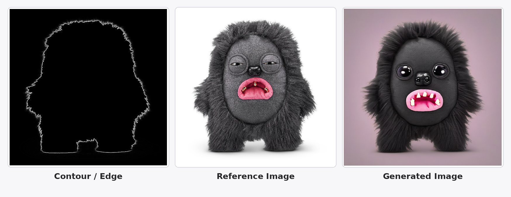

# ZURU Fuggler Image Generation

An experiment to validate whether a **LoRA + ControlNet (SDXL)** pipeline can reproduce the style of ZURU Fuggler plush toy reference images using only two training samples.

The result is good.

---

## Environment Setup

```bash
git clone https://github.com/liuzysy/zuru_img_generation.git
cd zuru_img_generation
pip install -e .
```

---

## Run

```bash
python scripts/run_two_image_with_lora.py \
  --config configs/base.yaml \
  --infer-pair pair_01 \
  --train-steps 200 \
  --skip-iou-check
```

Output: `outputs/two_image_with_lora/pair_01_generated.png`

---

## Model

Uses **SDXL + ControlNet**:

```yaml
model:
  family: sdxl
  base_model: stabilityai/stable-diffusion-xl-base-1.0
  controlnet_model: diffusers/controlnet-canny-sdxl-1.0
```

No Hugging Face login required.

---

## Dataset

```
dataset/two_image_demo/
  pair_01_real_sample.png
  pair_01_control_edge.png
  pair_01_shape_reference.png
  pair_02_real_sample.png
  pair_02_control_edge.png
  pair_02_shape_reference.png
```

---

## Result

Left = Edge / Mask control, Middle = Reference image, Right = Generated (573×573 crop)


